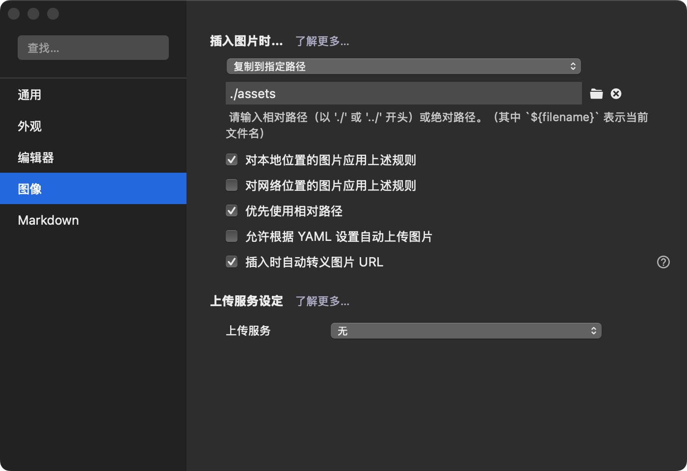

# 如何贡献社区文档的内容

思源开发者社区离不开大家的共同维护，也欢迎新朋友参与到文档编辑工作中来。

## 我不会弄这么复杂的东西，该如何做？{#my-anchor}

如果你觉得这些东西很复杂的话，你可以直接在 [论坛](https://ld246.com/) 中发布你的内容。

社区成员关注到你的内容后，将会帮助你把文档放到对应的位置。

## Community 成员如何贡献

感谢 [@Wetoria](https://wetoria.me) 及 [@terwer](https://github.com/terwer) 的贡献。

**现在，你可以通过思源，直接发布文章到此站 🎉。**

### 使用思源直接发布文章

在集市中，安装发布工具（siyuan-plugin-publisher)，并配置好 `VitePress` 的授权，即可将文档快速发布到此站。

参考配置如下：


### 多语言

思源社区文档目前支持简中（zh-Hans）、英文（en），如果你愿意为英文用户提供贡献，你可以创建多语言版本的文档。

为了书写体验，在处理文章多语言时，使用的是如下 locale 列表：

- zh
- en

根据后续说明的规则增加上述 `locale` 配置，即可自动将文章归类到不同语言下。

你可以使用下面两种模式，来创建不同版本的文章：

1. 使用文件名
2. 使用 `frontmatter`

---

#### 使用文件名

当你使用文件名时，将会按照 `-[locale]` 对文件名进行匹配。

比如这篇文档的文件名为 `contribute-zh.md`，将会归类到中文语言下。

同样的，本篇的英文版本 `contribute-en.md`，将会归类到英文语言下。

::: tip

如果后缀并非 `-[locale]` ，则默认归类到中文语言下。

:::

#### 使用 `frontmatter`

在你的文章顶部，使用 YAML frontmatter 配置 `locale` 参数，即可将文章归类到对应语言下。

参考配置：

```markdown
---
title: Title of a article
local: 'en' // [!code focus]
---

<!-- 这里是你的文章内容 -->
```

你的这篇 `Title of a article` 将会在英文环境下显示。

### 文章发布逻辑

当你在 `members/[yours]/` 下发布了文章以后，你可以在 [这里](/contents/) 查看所有的文章列表。

对应的 i18n 版本，将会全部列在多语言对应的 `/[locale]/contents` 目录下。 你可以在 [这里](/zh-Hans/contents/) 查看一个示例。

#### 如何将文档归类到对应的页面下

在仓库 `/docs/.vitepress/components/Forward` 里，提供了 `ForwardDoc.vue` 组件。

你只需要按照下面的方式使用，就能在页面中嵌入你的文档内容。支持选择行范围，具体请参考 [包含 markdown 文件](https://vitepress.dev/zh/guide/markdown#markdown-file-inclusion)。

```vue
<ForwardDoc
	member="[yours]"
>
  // 为了防止死循环，尖括号加了空格
  < !--@include: ../../members/wetoria/contribute-zh.md-- >
</ForwardDoc>
```

参数 `member` 为你的文件夹名称，目的是为了在嵌入时能正确地获取图片资源。

:::warning

目前没有处理使用相对路径的链接。如果你的文章中使用了相对路径，将有可能出现跳转 404 的问题。

在自动生成的 `contents` 目录下使用是没有问题的。

:::

### 注意事项 & 公约

#### 1. 配置发布工具的注意事项

请将发布工具的

1. `存储目录` 设置为 `docs/members/[yourname]`。
2. `图片存储目录` 设置为上述 `存储目录` 下的 `assets`，即 `docs/members/[yourname]/assets`。

#### 2. 发布文章前，调整发布工具的 YAML 配置

为了更好的展示内容，请在发布文章前，在 `发布工具` 的设置中选择 `源码模式`，去掉如下部分：

```yaml
---
title: 如何贡献
date: '2024-08-09 04:25:29'
head: []
outline: deep
sidebar: false // [!code --]
prev: false // [!code --]
next: false // [!code --]
---
```

#### 3. 手动编写的 MD 文件

如果你是手动创建的 MD 文件，为了更好的在侧边栏中显示你的内容，请在顶部的 frontmatter 配置中设置好 `title`。

比如 [测试发布插件](./test-plug-in-plug-in-z1gpive)，的文件名为 `test-plug-in-plug-in-z1gpive.md`，但在左侧 `Sidebar` 中展示的为 `测试发布插件`。

#### 4. 关于文章顺序

为了让各位 Community 成员更方便地发布内容，并且不需要专门配置目录。本仓库采用按人划分目录的方式。这样你可以直接通过发布插件一键发布内容。

:::info

VitePress 采用按目录划分的方式规划页面。

:::

为了让所有人的内容能够集中展示，在发布站点时，会自动根据成员内容生成左侧 `SideBar` 中的内容，就像你在本页 👈 左侧看到的那样。

---

考虑到文章展示的顺序，将会按照最后更新时间进行排序。

因此，除非正常更新，请不要恶意通过调整更新时间的方式恶意影响排序。

否则，社区人员有权删除你的文档，情节严重者将取消组织成员身份。

#### 5. 关于图片

在编写时，请将图片放置在你的 `个人目录/assets` 下，并确保文章中的图片地址采用的是 `相对路径` 的方式。

就像本篇前面两张图片一样，插入的内容为：

```


```

如果直接编写 MD 文档，可以使用 Typora 直接粘贴。相关配置如下：



## 非 Community 成员如何贡献

鉴于之前思源社区发生过恶意删库事件，因此并非所有人都能立马加入组织使用上述方式参与共建。

但是不加入组织并非就不能参与贡献，你依旧可以使用下面两种方式参与共建：

### 论坛发帖

你可以按照 [前面说的方式](#my-anchor)，在论坛中发布你的内容参与贡献。

### 提交 PR

你也可以通过 fork [siyuan-developer-docs](https://github.com/siyuan-community/siyuan-developer-docs) 这个仓库，按照上面同样的方式创建你的内容，以 PR 的方式参与贡献。

## 获取支持

如果你需要帮助 <LinkContactUS />。
